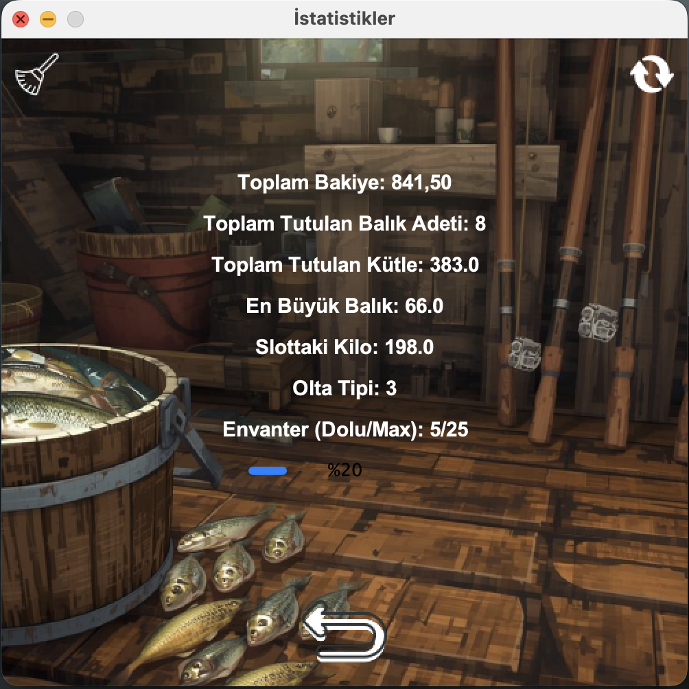
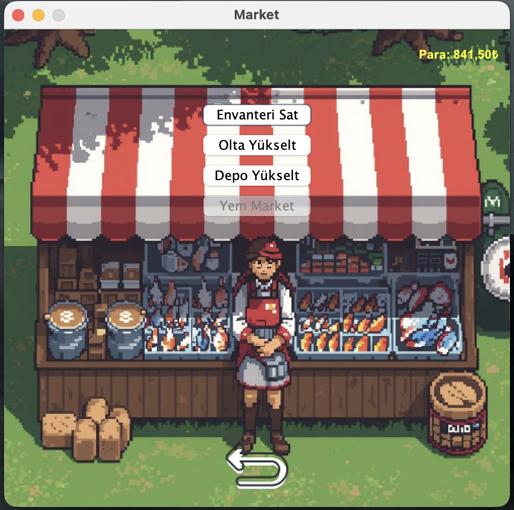
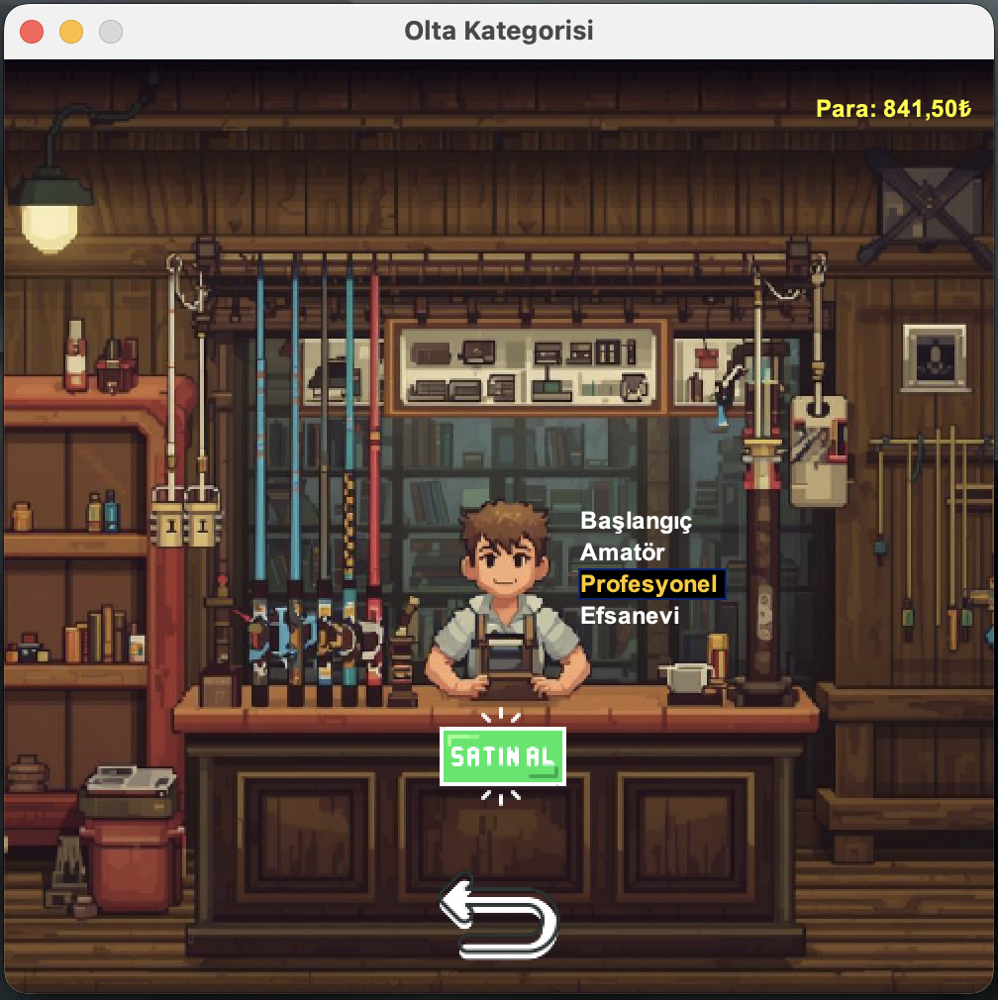
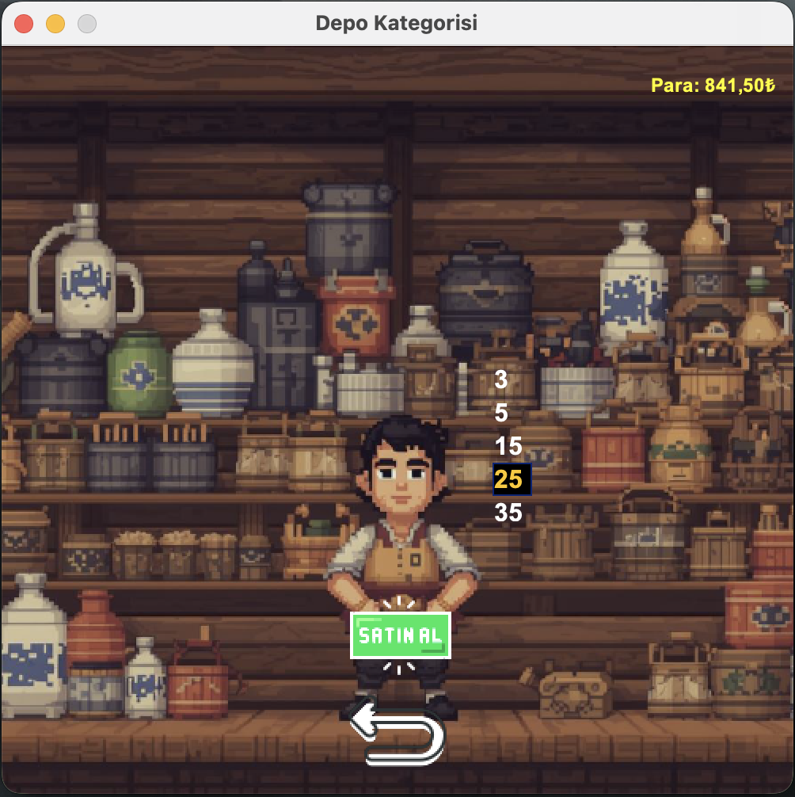

<<<<<<< HEAD
# 🎣 Balık Tutma Oyunu (Java)

Bu proje, Java programlama diliyle geliştirilen bir **balık tutma simülasyon oyunudur**. Menü tabanlı yapısıyla kullanıcıya balık tutma, marketten alışveriş yapma, oyuncu gelişimi gibi temel oyun deneyimleri sunar.

> ⚠️ **Proje hâlen geliştirilmektedir.** Java bilgim ilerledikçe yapıyı sadeleştiriyor, sınıf bağımlılıklarını azaltıyor ve yeni özellikler ekliyorum.  
> 🎯 **Swing konusunda yeterli seviyeye ulaştığımda**, mevcut metin tabanlı menüyü görsel kullanıcı arayüzüne (GUI) dönüştürmeyi planlıyorum.

---

## 🚀 Özellikler

- Menü konsol tabanlı kullanıcı arayüzü
- Balık tutma sistemi (kilogram ve tür farkı ile)
- Oyuncu bakiyesi ve slot yönetimi
- Marketten ekipman satın alma (olta, slot vb.)
- Oyun istatistiklerinin dosyaya kaydedilmesi ve yüklenmesi
- Kodun modüler ve nesne tabanlı yapıda tasarlanması

---

## 🧱 Sınıf Açıklamaları

| Sınıf | Açıklama |
|------|----------|
| `Main.java` | Uygulamanın giriş noktası. Menü akışını başlatır. |
| `MenuManager.java` | Ana menüyü ve kullanıcı seçimlerini yönetir. |
| `MarketManager.java` | Market işlemlerini (satın alma, fiyat gösterimi) gerçekleştirir. |
| `GameManager.java` | Oyuncu bilgilerini ve oyun durumunu tutar. |
| `GameMechanicsBase.java` | Slot limitleri, fiyat katsayıları gibi sabit mekanikleri tanımlar. |
| `PlayerStats.java` | Oyuncuya ait istatistikleri (balık adedi, toplam kg, en iyi balık vb.) tutar. |
| `ControlManager.java` | Kullanıcı girdilerini kontrol eder ve doğrular. |
| `SaveAndQuitTheGame.java` | Oyuncu verilerini dosyaya kaydeder ve geri yükler. |

---

## 🛠️ Kurulum ve Çalıştırma

### 1. Depoyu klonlayın

```bash
git clone https://github.com/mcanerarslan/balik-tutma-oyunu.git
cd balik-tutma-oyunu

javac Main.java
java Main.java
=======
# 🎣 Fishing Game - Öğrenci Projesi

Bu proje, üniversite öğrencisi olarak geliştirdiğim Java tabanlı balık tutma simülasyon oyunudur. Java Swing kütüphanesini kullanarak GUI geliştirmeyi öğrenmek ve nesne yönelimli programlama prensiplerini uygulamak amacıyla oluşturulmuştur. Oyuncular farklı oltalar kullanarak balık tutabilir, envanterlerini yönetebilir, para kazanabilir ve oyun istatistiklerini kaydedebilir.

## 🎯 Proje Hedefleri

Bu proje, aşağıdaki becerileri geliştirmek amacıyla geliştirilmiştir:
- Java Swing ile grafiksel kullanıcı arayüzü tasarımı
- Nesne yönelimli programlama (OOP) prensipleri
- Dosya işlemleri ve veri kalıcılığı
- Rastgele sayı üretimi ve oyun mantığı
- Modüler kod yapısı ve sınıf tasarımı

## 🛠️ Kullanılan Teknolojiler

- **Programlama Dili**: Java 8
- **GUI Framework**: Java Swing
- **IDE**: Eclipse
- **Derleme**: javac
- **Paketleme**: JAR

## ✨ Özellikler

- **Balık Tutma Mekaniği**: Rastgele ağırlıkta balıklar yakalama
- **Envanter Sistemi**: Yakalanan balıkları saklama ve yönetme (maksimum slot limiti)
- **Para Sistemi**: Balık satışından para kazanma ve harcama
- **Farklı Oltalar**: Başlangıç, gelişmiş ve premium oltalar (farklı çarpanlar ile)
- **Market**: Oltaları satın alma ve yükseltme sistemi
- **İstatistikler**: Toplam yakalanan balık sayısı, toplam ağırlık, en büyük balık
- **Kaydetme/Yükleme**: Oyun ilerlemesini txt dosyasına kaydetme ve yükleme
- **Grafiksel Arayüz**: Swing tabanlı kullanıcı dostu arayüz ve görseller

## 📋 Gereksinimler

- Java 8 (JDK 1.8)
- Java Swing kütüphanesi (Java SE'de varsayılan olarak gelir)

## 🚀 Kurulum ve Çalıştırma

### Kaynak Koddan Çalıştırma

1. Projeyi klonlayın veya indirin:
   ```
   git clone <repository-url>
   cd fishing-game
   ```

2. Kaynak kodlarını derleyin:
   ```
   javac -d bin src/*.java
   ```

3. Oyunu çalıştırın:
   ```
   java -cp bin Main
   ```

### Release JAR Dosyası ile Çalıştırma

1. Releases bölümünden en son JAR dosyasını indirin (örneğin: `fishing-game-v1.0.jar`).

2. JAR dosyasını çalıştırın:
   ```
   java -jar fishing-game-v1.0.jar
   ```

Bu yöntem için Java 8 yüklü olmalıdır.

## 📸 Oyun Ekran Görüntüleri







## 🎥 Demo Video

Oyunun oynanışı hakkında daha fazla bilgi için aşağıdaki YouTube videosunu izleyebilirsiniz:

[](https://youtu.be/4ydNwRml1M0)

## 🔮 Gelecekteki Geliştirmeler

- Çoklu dil desteği
- Daha fazla balık türü ve özellik
- Daha gelişmiş grafikler ve animasyonlar

## 📚 Öğrenilen Dersler

Bu proje sayesinde:
- Java Swing'in temel bileşenlerini öğrendim
- Event-driven programming kavramını uyguladım
- Dosya I/O işlemlerini pratik yaptım
- Kod organizasyonu ve modülerlik önemini anladım
- Hata yakalama ve exception handling becerilerini geliştirdim
>>>>>>> 48ca3b4 (feat: UI improvements, fish types, and upgrade mechanics)
