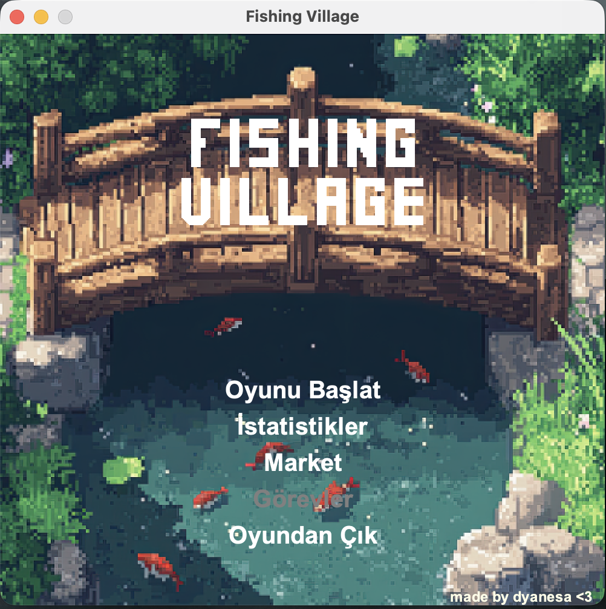
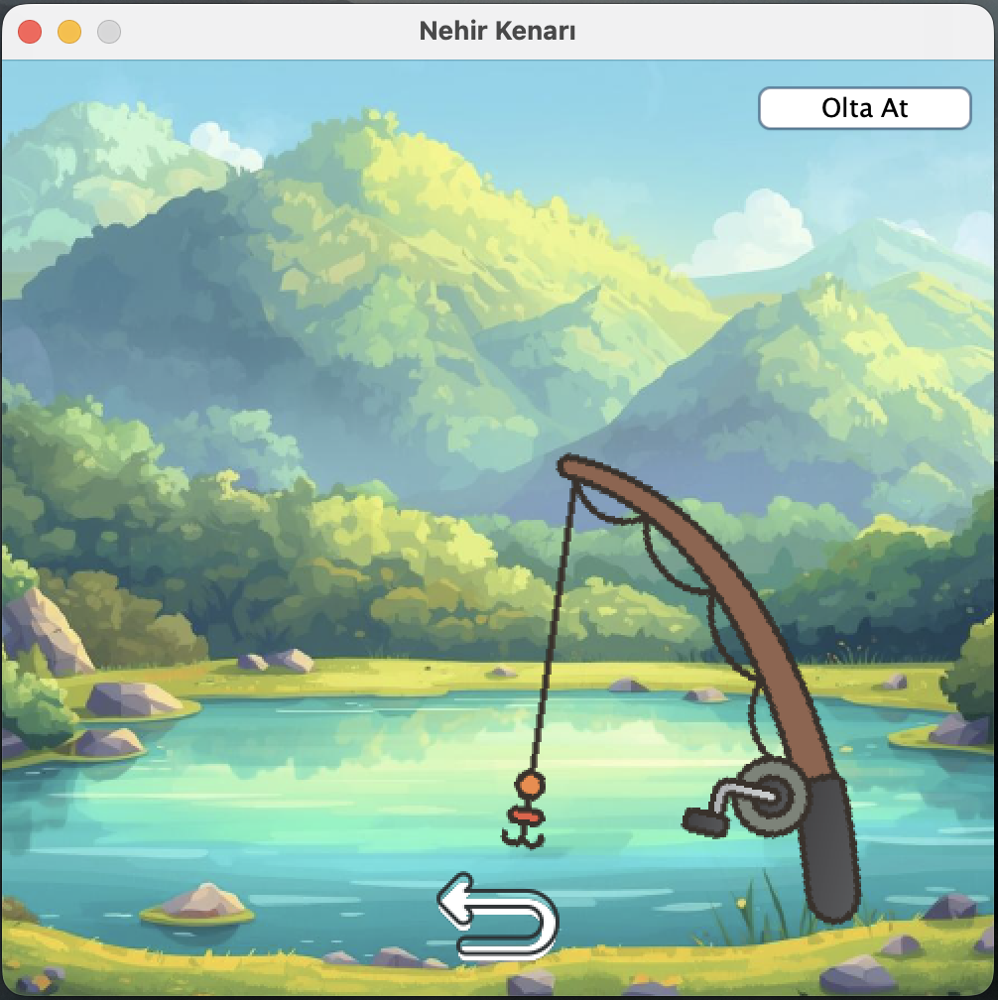

# ❌ Balık Tutma Oyunu ⭕

Java Swing kullanılarak geliştirilmiş, modern masaüstü görünümüne sahip ve balık tutma mekanikleriyle zenginleştirilmiş bir oyun projesidir.

## 📸 Oyun Önizleme
Aşağıdaki ekran görüntüleri, projenin ana oynanış ekranlarını gösterir:





## 🎬 Oynanış Videosu
Bu videoda oyunun temel işleyişi ve ekran akışı gösterilmektedir:

[](https://www.youtube.com/watch?v=4ydNwRml1M0)

> Görsele tıklayarak YouTube üzerinden izleyebilirsiniz.

## 🚀 Öne Çıkan Özellikler

- **Java Swing GUI**: Masaüstünde çalışan görsel kullanıcı arayüzü
- **Balık Tutma Sistemi**: Farklı ağırlıklarda balık yakalama
- **Envanter & Slot Yönetimi**: Yakalanan balıkları depolama ve limit yönetimi
- **Market Sistemi**: Yeni oltalar ve ekipman satın alma
- **Oyun İstatistikleri**: Toplam yakalanan balık, en iyi balık ve para takibi
- **Veri Kaydetme**: Oyun verilerini dosyaya kaydedip yükleme

## 📥 Release Sürümü
Projeyi test etmek ve paylaşmak için release JAR dosyası hazırlandı.

### Release kullanımı

1. GitHub `Releases` bölümünden en son `.jar` dosyasını indirin.
2. Terminal veya komut satırından aşağıdaki komutu çalıştırın:

```bash
java -jar fishing-game-v1.0.jar
```

> Bu proje Java 8 (JDK 1.8) ile uyumludur.

## 🧠 Teknik Detaylar

- **Swing tabanlı arayüz**
- **OOP yapısı**: `Main`, `Game`, `Inventory`, `SaveAndQuitTheGame` sınıfları
- **Dosya tabanlı kaydetme**: `save/savegame.txt`
- **Dynamic asset yükleme**: `src/assets` klasöründeki görseller

## 📌 Kurulum ve Çalıştırma

### Kaynak Koddan Çalıştırma

```bash
git clone <repository-url>
cd fishing-game
javac -d bin src/*.java
java -cp bin Main
```

### Release JAR ile Çalıştırma

```bash
java -jar fishing-game-v1.0.jar
```

## 📋 Gereksinimler

- Java 8 (JDK 1.8)
- Java Swing


